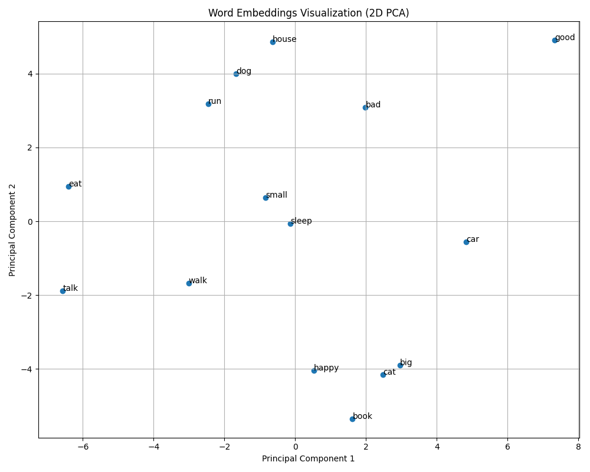

# CuteGPT

A custom small LLM for understanding the process of creating, training and using. This project demonstrates the basic concepts of language model creation, training, and inference in a simplified form.

## Overview

CuteGPT is a minimal implementation of a transformer-based language model (CuteLLM) that can be trained on simple text data and used for basic text generation and phrase completion tasks. It's designed to be educational rather than practical, focusing on clarity and simplicity over performance.

## Project Structure

```
cutellm/            # Core model implementation
  ├── __init__.py   # Package exports
  ├── model_base.py # CuteLLM model definition
  ├── inference_base.py # Text generation functions
  ├── tokenizer.py  # Tokenization functionality
  └── training_base.py # Model training functionality

data/               # Training data
  └── training_data.txt # Sample text for training

examples/           # Educational examples
  ├── 01_basic_text_generation.py # Basic text generation demo
  ├── 02_interactive_completion.py # Interactive text completion
  ├── 03_custom_fine_tuning.py # Fine-tuning on custom data
  ├── 04_phrase_completion.py # Phrase completion with mask tokens
  ├── 05_model_inspection.py # Model inspection and visualization
  └── README.md     # Examples documentation

models/             # Saved model weights
  └── cute_llm.pth  # Trained model weights

scripts/            # Utility scripts
  ├── evaluate_phrase_completion.py # Phrase completion evaluation
  ├── generate_text.py # Text generation script
  ├── inspect_model.py # Model inspection utilities
  └── model_visualization.py # Model visualization tools

tests/              # Test suite
  ├── test_completion.py # Tests for text completion
  └── test_phrase_completion.py # Tests for phrase completion

Makefile           # Build automation
setup.py           # Package setup script
```

## Visualizations

The project includes tools to generate visualizations that help understand the model:

### Model Architecture

Visual representation of the model's layers, showing the embedding layer, transformer blocks, and output layer:


### Logits Visualization

Bar charts showing the model's token predictions at each position in the input text:


### Token Prediction Heatmap

Heatmap showing prediction probabilities across different tokens, providing insight into the model's decision-making process:


### Word Embeddings Visualization

A 2D projection of the model's word embeddings using PCA, showing how words are represented in the model's vector space. Similar words appear closer together, demonstrating how the model captures semantic relationships between words:



Generate these visualizations with:
```bash
make visualize
```

You can view all visualizations together in the interactive HTML page:
```
docs/model_visualizations.html
```

## Getting Started

### Installation

```bash
# Clone the repository
git clone https://github.com/akeelnazir/cutegpt.git
cd cutegpt

# Install dependencies
pip install -r requirements.txt

# Set up environment configuration (optional)
cp .env.example .env
# Edit .env with your preferred settings

# Install the package in development mode
pip install -e .
```

### Training the Model

```bash
# Train the model using the provided training data
make run
```

### Testing Phrase Completion

```bash
# Test the model's phrase completion abilities
make test
```

### Generating Text

```bash
# Generate text using the trained model
python scripts/generate_text.py
```

## Makefile Commands

- `make run`: Train the model
- `make generate`: Generate text using the trained model
- `make inspect`: Inspect the model architecture
- `make test`: Test phrase completion

## Educational Value

This project demonstrates:
- Basic transformer model architecture
- Simple tokenization for NLP tasks
- Training loop implementation
- Text generation with and without temperature sampling
- Phrase completion testing

## Core Components and Processes

CuteGPT consists of several core components, each with a specific role in the language model pipeline. Below is a detailed breakdown of each component and its process.

### Model Architecture (`model_base.py`)

The `model_base.py` file defines the CuteLLM model architecture. Here's how it works:

1. **Model Initialization**:
   - Creates an embedding layer that converts token IDs to vectors
   - Builds a transformer encoder with specified layers and attention heads
   - Adds a language model head (linear layer) to project to vocabulary size

2. **Forward Pass**:
   - Embeds input tokens into continuous vectors
   - Processes embeddings through transformer layers
   - Projects transformer outputs to vocabulary size to get token probabilities

### Tokenization (`tokenizer.py`)

The `tokenizer.py` file implements the SimpleWordTokenizer. Here's how it processes text:

1. **Tokenizer Initialization**:
   - Creates a vocabulary with common English words
   - Adds special tokens (`<unk>` for unknown words, `<mask>` for masked tokens)
   - Builds word-to-ID and ID-to-word mappings

2. **Text Encoding**:
   - Replaces `___` placeholders with `<mask>` tokens
   - Splits text into words and converts to lowercase
   - Maps each word to its corresponding token ID
   - Handles unknown words with the `<unk>` token

3. **Token Decoding**:
   - Converts token IDs back to words
   - Joins words with spaces to form readable text

### Training Process (`training_base.py`)

The `training_base.py` file implements a complete training pipeline for the CuteLLM model. Here's a detailed breakdown of each step in the process:

1. **Configuration Setup**: Defines model hyperparameters including vocabulary size, embedding dimension, number of attention heads, and transformer layers.

2. **Tokenizer Initialization**: Creates a simple word-level tokenizer with the specified vocabulary size.

3. **Training Data Preparation**:
   - Loads text from `data/training_data.txt`
   - Removes comments and empty lines
   - Tokenizes the text into token IDs
   - Creates sequences of fixed length with 50% overlap
   - Splits sequences into input-target pairs for next-token prediction
   - Pads sequences to uniform length
   - Converts data to PyTorch tensors
   - Creates a DataLoader with the specified batch size

4. **Model Initialization**: Creates a CuteLLM model instance with the specified configuration and initializes the Adam optimizer and CrossEntropyLoss function.

5. **Training Loop**:
   - Runs for a specified number of epochs
   - For each batch:
     - Performs forward pass through the model
     - Calculates loss between predictions and targets
     - Performs backward pass to compute gradients
     - Updates model parameters with optimizer
   - Tracks and logs the average loss for each epoch

6. **Model Saving**: Saves the trained model weights to `models/cute_llm.pth`.

If the training data file is not found or doesn't contain enough text, the system falls back to generating synthetic (dummy) data for training.

### Text Generation (`inference_base.py`)

The `inference_base.py` file provides functions for generating text with the trained model:

1. **Greedy Text Generation** (`generate` function):
   - Tokenizes the input prompt
   - Iteratively predicts the next token:
     - Passes current sequence through the model
     - Selects the most likely next token (highest probability)
     - Adds the predicted token to the sequence
   - Decodes the final token sequence back to text

2. **Sampling-based Text Generation** (`sample_generate` function):
   - Tokenizes the input prompt
   - Iteratively samples the next token:
     - Passes current sequence through the model
     - Applies temperature scaling to control randomness
     - Converts logits to a probability distribution
     - Randomly samples the next token according to probabilities
     - Adds the sampled token to the sequence
   - Decodes the final token sequence back to text

The temperature parameter controls the randomness of generation - higher values produce more diverse but potentially less coherent text.

## Configuration and Logging

CuteGPT supports configuration through environment variables, making it easy to adjust settings without modifying code.

### Environment Configuration

You can configure the model, training parameters, and logging level by creating a `.env` file in the project root:

```bash
# Copy the example configuration
cp .env.example .env

# Edit the .env file to customize settings
```

The following settings can be configured:

| Variable | Description | Default |
|----------|-------------|--------|
| LOG_LEVEL | Logging verbosity (DEBUG, INFO, WARNING, ERROR, CRITICAL) | INFO |
| MODEL_VOCAB_SIZE | Size of the vocabulary | 1000 |
| MODEL_D_MODEL | Dimension of the model embeddings | 128 |
| MODEL_N_HEADS | Number of attention heads | 4 |
| MODEL_N_LAYERS | Number of transformer layers | 2 |
| TRAINING_BATCH_SIZE | Batch size for training | 8 |
| TRAINING_SEQ_LENGTH | Sequence length for training | 20 |
| TRAINING_EPOCHS | Number of training epochs | 10 |

### Logging

CuteGPT uses Python's built-in logging module with configurable verbosity levels:

- **DEBUG**: Detailed information, typically useful only when diagnosing problems
- **INFO**: Confirmation that things are working as expected
- **WARNING**: Indication that something unexpected happened, but the program is still working
- **ERROR**: Due to a more serious problem, the program has not been able to perform some function
- **CRITICAL**: A serious error, indicating that the program itself may be unable to continue running

To change the logging level:

```bash
# In your .env file
LOG_LEVEL=DEBUG  # For detailed logs
# or
LOG_LEVEL=WARNING  # For minimal logs
```

## License

This project is for educational purposes only.
