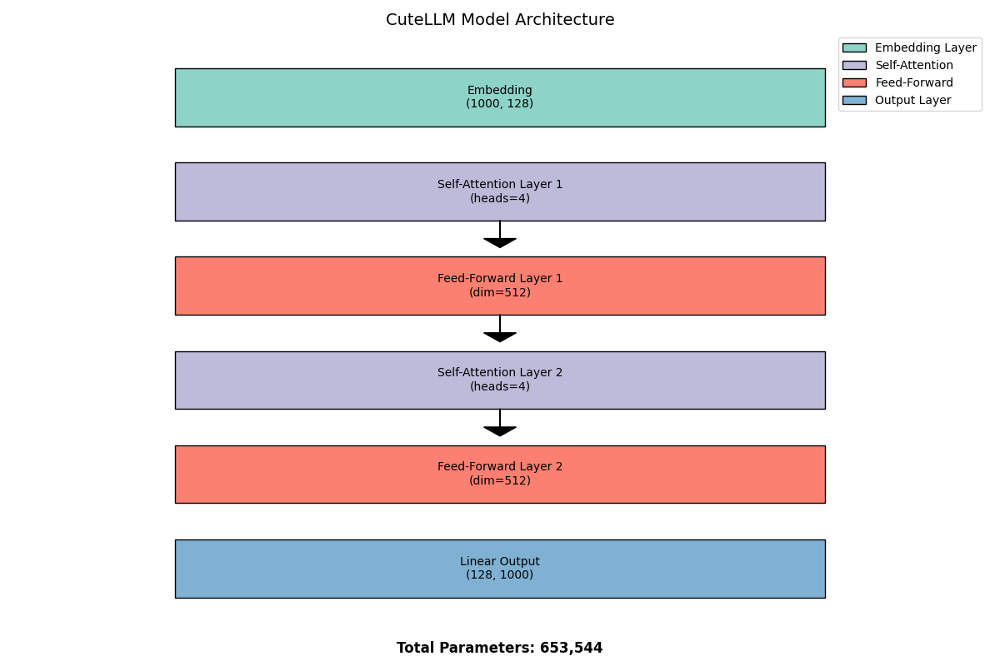
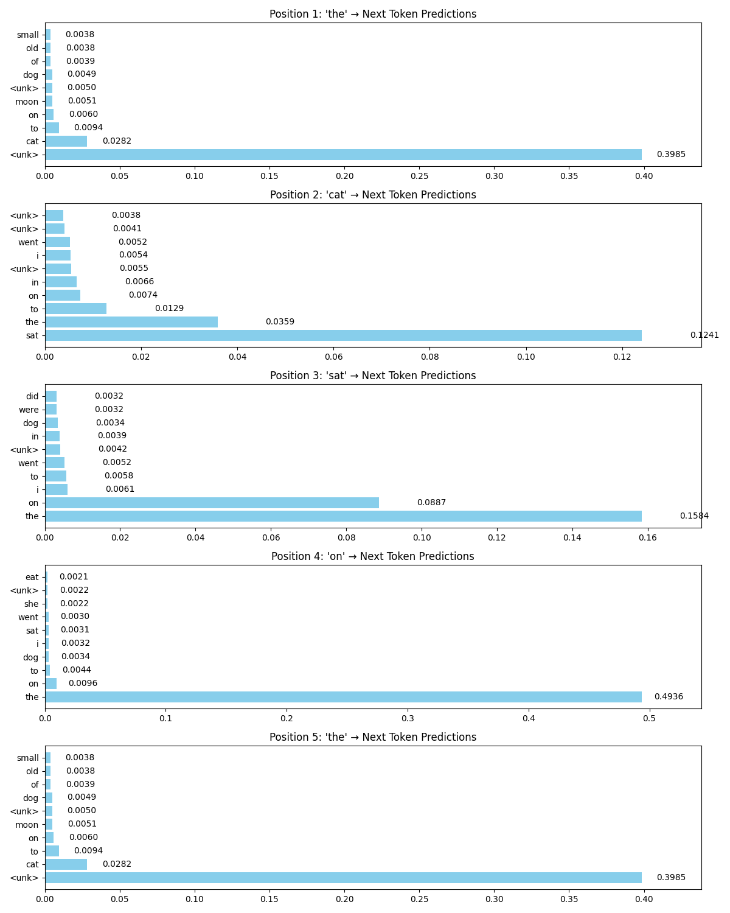

# CuteGPT

A custom small LLM for understanding the process of creating, training and using. This project demonstrates the basic concepts of language model creation, training, and inference in a simplified form.

## Overview

CuteGPT is a minimal implementation of a transformer-based language model (CuteLLM) that can be trained on simple text data and used for basic text generation and phrase completion tasks. It's designed to be educational rather than practical, focusing on clarity and simplicity over performance.

## Project Structure

```
cutellm/            # Core model implementation
  ├── __init__.py   # Package exports
  ├── model_base.py # CuteLLM model definition
  ├── inference_base.py # Text generation functions
  ├── tokenizer.py  # Tokenization functionality
  └── training_base.py # Model training functionality

data/               # Training data
  └── training_data.txt # Sample text for training

examples/           # Educational examples
  ├── 01_basic_text_generation.py # Basic text generation demo
  ├── 02_interactive_completion.py # Interactive text completion
  ├── 03_custom_fine_tuning.py # Fine-tuning on custom data
  ├── 04_phrase_completion.py # Phrase completion with mask tokens
  ├── 05_model_inspection.py # Model inspection and visualization
  └── README.md     # Examples documentation

models/             # Saved model weights
  └── cute_llm.pth  # Trained model weights

scripts/            # Utility scripts
  ├── evaluate_phrase_completion.py # Phrase completion evaluation
  ├── generate_text.py # Text generation script
  ├── inspect_model.py # Model inspection utilities
  └── model_visualization.py # Model visualization tools

tests/              # Test suite
  ├── test_completion.py # Tests for text completion
  └── test_phrase_completion.py # Tests for phrase completion

Makefile           # Build automation
setup.py           # Package setup script
```

## Visualizations

The project includes tools to generate visualizations that help understand the model:

### Model Architecture

Visual representation of the model's layers, showing the embedding layer, transformer blocks, and output layer:



### Logits Visualization

Bar charts showing the model's token predictions at each position in the input text:



### Token Prediction Heatmap

Heatmap showing prediction probabilities across different tokens, providing insight into the model's decision-making process:


Generate these visualizations with:
```bash
make visualize
```

## Getting Started

### Installation

```bash
# Clone the repository
git clone https://github.com/akeelnazir/cutegpt.git
cd cutegpt

# Install dependencies
pip install -r requirements.txt

# Install the package in development mode
pip install -e .
```

### Training the Model

```bash
# Train the model using the provided training data
make run
```

### Testing Phrase Completion

```bash
# Test the model's phrase completion abilities
make test
```

### Generating Text

```bash
# Generate text using the trained model
python scripts/generate_text.py
```

## Makefile Commands

- `make run`: Train the model
- `make generate`: Generate text using the trained model
- `make inspect`: Inspect the model architecture
- `make test`: Test phrase completion

## Educational Value

This project demonstrates:
- Basic transformer model architecture
- Simple tokenization for NLP tasks
- Training loop implementation
- Text generation with and without temperature sampling
- Phrase completion testing

## License

This project is for educational purposes only.
